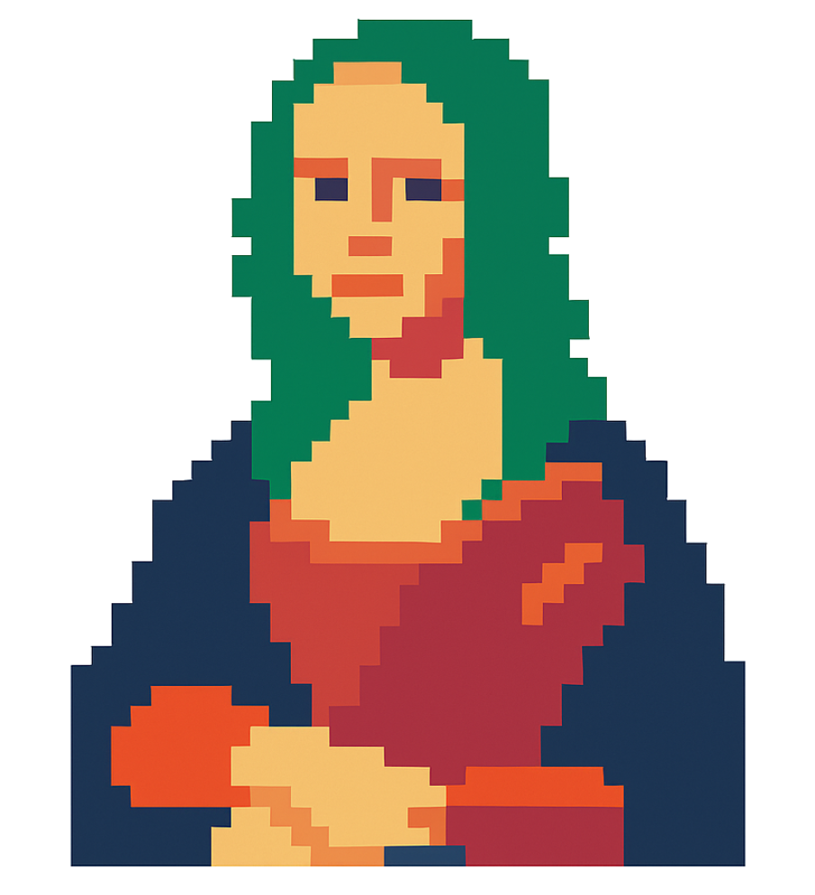

# Pixel Animator

<p align="center">
  
</p>

Pixel Animator is a web-based application that allows users to upload an image and reveal it pixel by pixel in a zigzag pattern. The animation speed and pixel size are adjustable, and users can pause, resume, reset, or download the revealed image. The project uses HTML, JavaScript (ES modules), and Tailwind CSS for styling, with audio feedback for user interactions.

---

## Features

* **Image Upload**: Upload any image (PNG, JPEG, etc.) to be pixelated and revealed.
* **Zigzag Reveal Animation**: Pixels are revealed in a zigzag pattern across the canvas.
* **Adjustable Pixel Size**: Choose from small (20x20), medium (25x25), or large (30x30) pixel sizes.
* **Animation Speed Control**: Adjust the speed of the reveal animation using a slider (0.5x to 5x).
* **Pause/Resume**: Toggle the animation with a button or spacebar.
* **Reset**: Restart the reveal process with the reset button or 'R' key.
* **Download**: Save the fully revealed image as a PNG using the download button or 'D' key.
* **Progress Tracking**: Displays the percentage of the image revealed and the elapsed time.
* **Audio Feedback**: Plays sound effects for actions like starting, resetting, or moving the cursor.
* **Responsive Design**: Adapts to different screen sizes, with a maximum canvas size of 800x800 pixels.

---

## Prerequisites

* A modern web browser (Chrome, Firefox, Safari, etc.) with JavaScript enabled.
* A local server (e.g., Python's HTTP server or Live Server extension in VS Code) to serve the project due to ES module CORS requirements.

---

## Serve the Project

Use a local server to serve the project:

```bash
python3 -m http.server 8000
```

Alternatively, use the Live Server extension in VS Code or any other local server tool. Then, open your browser and navigate to:

```
http://localhost:8000
```

---

## Usage

### Upload an Image

* Click the "Upload Image" input and select an image file (PNG, JPEG, etc.).
* The image will be pixelated based on the selected pixel size, and the reveal animation will start automatically.

### Control the Animation

* **Pause/Resume**: Click the "Pause" button or press the spacebar.
* **Reset**: Click the "Reset" button or press 'R'.
* **Download**: Click the "Download Image" button or press 'D' (after the image is fully revealed).
* **Pixel Size**: Select a pixel size (Small, Medium, Large) from the dropdown.
* **Animation Speed**: Use the slider (0.5x to 5x).

### Monitor Progress

* **Reveal Duration**: Shows elapsed time in MM\:SS format.
* **Progress**: Shows percentage of the image revealed.
* **Status**: Indicates the current state (e.g., "Waiting for Image", "Image Loaded", "Image Fully Revealed").

---

## File Structure

```
pixel-animator/
├── css/
│   ├── styles.css        # Custom or additional CSS styles
│   ├── output.css        # Tailwind CSS compiled output
├── js/
│   ├── app.js            # Main entry point, initializes the game
│   ├── constants.js      # Game constants and DOM elements
│   ├── state.js          # Game state and global variables
│   ├── audio.js          # Audio playback functions
│   ├── canvas.js         # Canvas setup and resizing
│   ├── grid.js           # Grid setup and image pixelation
│   ├── animation.js      # Animation logic and rendering
│   ├── events.js         # Event handlers and listeners
│   ├── utils.js          # Utility functions (e.g., download image)
├── index.html            # Main HTML file with UI
├── README.md             # Project documentation
```

---

## Keyboard Controls

* **Spacebar**: Pause or resume the animation.
* **R**: Reset the reveal process.
* **D**: Download the revealed image (when complete).

---

## Notes

* **CSS Files**: Ensure `css/styles.css` and `css/output.css` are present.
* **ES Modules**: JavaScript files use ES modules, so the project must be served via a local server (e.g., `http://localhost`) to avoid CORS issues.
* **Audio Support**: Audio feedback uses the Web Audio API. If unsupported, the app will still work without sound.
* **Canvas Size**: Dynamically set based on the container width, with a maximum of 800x800 pixels. Resizes on window resize.